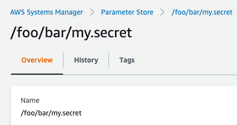

# AWS Paramstore Module

This module adds a property resolver which loads properties from AWS Parameter Store. Useful for secrets that should be
accessible like every other Spring Boot properties from `application.(yml/properties)`.

## Usage

Assuming you have the following parameter in your AWS Parameter Store:



Then you could configure the path for resolving the properties in your `application.yml`:
```
babbage:
  aws:
    paramstore:
      path: /foo/bar        
```
In your Spring Component you are now able to access the value without the path:
```
@Component
class MyComponent(@Value("\${my.secret}") mySecret: String) {
    // implementation here
}
```


## Configurations:

| property                                       | default value | description                                                                                                                                                                 |
|------------------------------------------------|---------------|-----------------------------------------------------------------------------------------------------------------------------------------------------------------------------|
| babbage.aws.paramstore.enabled                 | true          | Enables property resolving from AWS Parameter Store.                                                                                                                        |
| babbage.aws.paramstore.path (required)         | -             | Enables property resolving from AWS Parameter Store.                                                                                                                        |
| babbage.aws.paramstore.addWithLowestPrecedence | false         | If enable, it will add the property to the end of the PropertySource. Otherwise it will be added to the top and will override properties from application.(yml/properties). |
