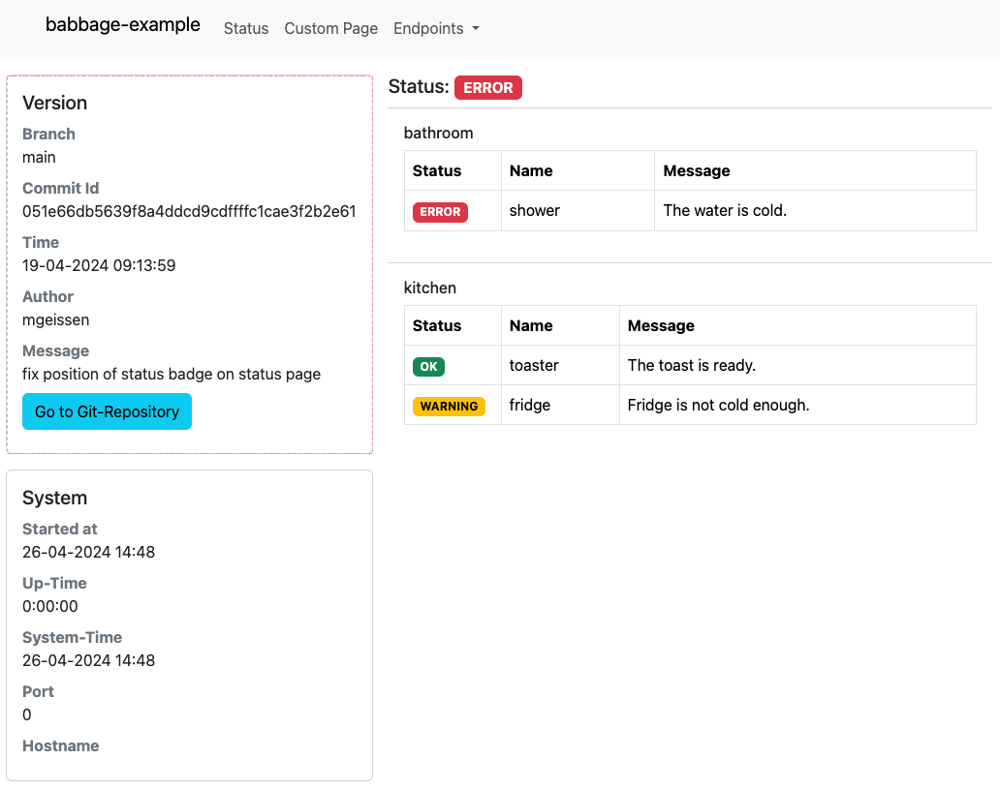
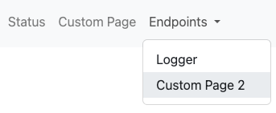

# Core Module

The core module contains basic components that are needed (in our opinion) for every microservice. A basic admin page,
actuator configuration and basic metrics.

## Usage

### Management pages

The main idea of the management pages is, that you could easily view and edit some configurations of your service just
from your web browser. So, based on the configured path for `management.endpoints.web.base-path`, there are some
predefined useful endpoints. For example, you could use the Status Page (/status) to view the current version of the
service or change the log level of your loggers via the Logger Console (/logger). It's also possible to add custom pages
that will be added to the management navigation.

Note: For production services that are reachable for your customers, the management pages should be secured and only
reachable for the developers. This could be done with spring security. The security aspect is not part of
babbage-microservices because there too many ways of securing services in a microservices' architecture.

#### Status ( /status ):

On the status page you will find a summary of all important information about your service. This includes general system
information, if enabled the git information, and all infos from the registered `StatusDetailIndicator` beans.

_Git section_:<br/>
To be able to see the git information on the status page, you have to provide a `git.properties` in the resource
section of your build folder and have to set `babbage.status.git.enabled=true` in your `application.properties/.yaml`. As shown in the example application you could just use
the [gradle git properties plugin](https://github.com/n0mer/gradle-git-properties) to generate the file.



#### Logger ( /logger ):

If the property `management.endpoint.loggers.enabled` is set to `true`, an overview page for all loggers are available.
You are able to change the log level for every logger by clicking on the corresponding log level on the right side.
Please note, that `logger` is added to the property `management.endpoints.web.exposure.include`, so that the state of a
logger could be change from the overview page itself.


#### Add custom management pages

You could add a custom management page that uses the general management page layout in three steps:

1. Add Controller that implements the `ManagementController` interface. This will add the required model attributes to
   the template, that are required for the navigation.
2. Create a new controller endpoint (path should be based on `management.endpoints.web.base-path` property) inside your
   added controller, and use the following html template:

```
<!DOCTYPE html>
<html xmlns:th="http://www.thymeleaf.org" lang="en">
<head th:replace="~{fragments/head  :: head}"></head>
<body>
<div th:replace="~{fragments/navigation  :: navigation}"></div>

<div class="container">
    <!-- Your content with bootstrap 5.2.x -->
</div>

<span th:replace="~{fragments/footer :: footer}"></span>
</body>
</html>
```

3. Add a `NavBarItem` Bean to your application context to register your new endpoint to the navigation. The `path` is
   based on the `management.endpoints.web.base-path` property and should the one from

```
@Bean
fun customMainNavItem() = NavbarItem(
  path = "/custom",
  name = "Custom Page",
  type = NavbarItemType.MAIN, # or NavbarItemType.SUB because 
  order = 42
)
```

As a result, you should see a new navbar item in main navbar or in the dropdown based on the `type` in the `NarbarItem`
bean:


In the [example project](../example) you could find a full implementation of a custom management page.

### Status Detail Indicators

_will be added soon_

### InfoContributor

_will be added soon_

## Configurations

### Spring properties that are used from some components

| property                                       | description                                                         |
|------------------------------------------------|---------------------------------------------------------------------|
| info.app.name   (required)                     | Used to show on status page.                                        |
| spring.webflux.base.path                       | Base path for the web application and used for some links on pages. |
| management.endpoints.web.base-path  (required) | Base path for all management endpoints like /status.                |
| management.endpoints.loggers.enabled           | If enabled, the /logger endpoint will added.                        |

### Custom properties

| property                               | default | description                                        |
|----------------------------------------|---------|----------------------------------------------------|
| babbage.metrics.startup-metric.enabled | false   | If enabled, a metric for startup duration is added |
| babbage.status.useCommitAsVersion      | false   | _tbd_                                              |
