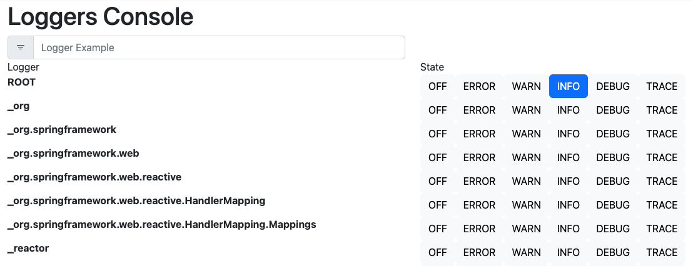

# Core Module

The core module contains basic components that are needed (in our opinion) for every microservice. A basic admin page, actuator configuration and basic metrics. 

## Usage

### Admin area
Based on the configured path for `management.endpoints.web.base-path`, there are some useful endpoints.

_/status_: 

TODO:
- Git Info: git.properties are shown on status page
- Screenshot

_/logger_: 

If the property `management.endpoint.loggers.enabled` is set to `true`, an overview page for all loggers are available. You're are able to change the log level for every logger by clicking on the corresponding log level on the right side. Please note, that `logger` is added to the property `management.endpoints.web.exposure.include`, so that the state of a logger could be change from the overview page itself.

### Status Detail Indicators
TODO

## InfoContributor
TODO

## configurations

### spring properties that are used from some components
| property                                       | description                                                         |
|------------------------------------------------|---------------------------------------------------------------------|
| info.app.name   (required)                     | Used to show on status page.                                        |
| spring.webflux.base.path                       | Base path for the web application and used for some links on pages. |
| management.endpoints.web.base-path  (required) | Base path for all management endpoints like /status.                |
| management.endpoints.loggers.enabled           | If enabled, the /logger endpoint will added.                        |

### custom properties
| property                                       | default | description                                        |
|------------------------------------------------|---------|----------------------------------------------------|
| babbage.metrics.startup-metric.enabled         | false   | If enabled, a metric for startup duration is added |
| babbage.status.useCommitAsVersion              | false   | _tbd_                                              |
